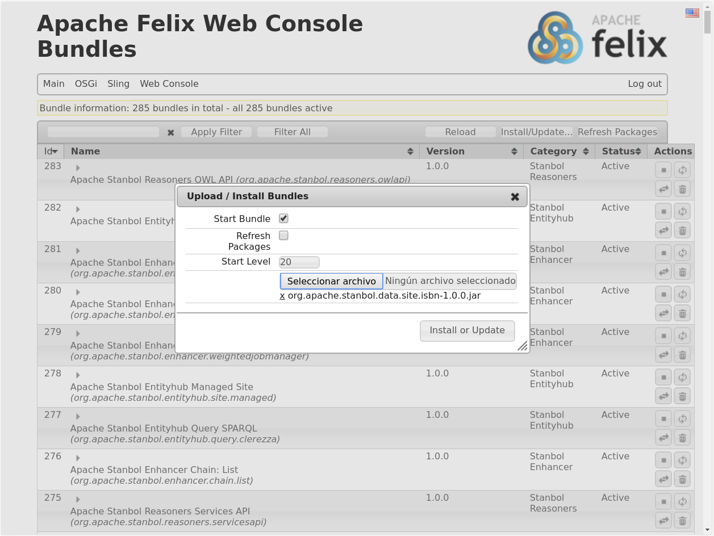

# 1 Example > 1 Exercise (Solved) 

Lo primero que debemos realizar para dar uso a nuestro sistema es cargar los datos iniciales y para ello será necesario obtener la herramienta de indexado de Apache Stanbol por lo que descargaremos la última versión de Apache Stanbol disponible en su [web oficial](https://stanbol.apache.org/downloads/) y lo descomprimimos en una carpeta del equipo. Tras esto deberemos acceder a la carpeta y compilar el proyecto con el siguiente comando:

```
mvn clean install -DskipTests
```
Tras la compilación crearemos una carpeta de trabajo en otra ruta del equipo y copiaremos el archivo jar generado en la siguiente ruta de la compilación `entityhub/indexing/genericrdf/target/org.apache.stanbol.entityhub.indexing.genericrdf-*.jar` a nuestra carpeta de trabajo.

Para generar el proyecto con el que debemos trabajar ejecutaremos el siguiente comando en nuestra carpeta de trabajo:

```
java -jar org.apache.stanbol.entityhub.indexing.genericrdf-*.jar init
```
Ahora procederemos a configurar la herramienta de indexado. Para ello accedemos a `indexing/config` y modificaremos los archivos `indexing.properties` y `mappings.txt`. En el primero se deben definir algunas variables como el nombre del filtro, la descripción o con que fuente mapear los objetos. En el segundo definiremos el mapeo, es decir, el ISBN. Puede encontrar estos archivos en nuestro [repositorio](https://github.com/ManuelLR/apache-stanbol-example/tree/master/1_Example/1_Exercise/indexing-config). También debemos añadir la colección de objetos que deseamos que tenga indexado en local a la carpeta `indexing/resources/rdfdata`. Estos datos podremos encontrarlo en la siguiente carpeta del [repositorio](https://github.com/ManuelLR/apache-stanbol-example/tree/master/1_Example/1_Exercise/data). 

Una vez que tenemos todo configurado procederemos a crear el índice. Para ello ejecutaremos en la carpeta de trabajo el comando:

```
java -Xmx1024m -jar org.apache.stanbol.entityhub.indexing.genericrdf-*.jar index
```

Tras esto se nos habrán generado dos archivos en la carpeta `indexing/dist`. Un zip que contiene los objetos del índice y un `jar`. Para usarlos en nuestra instancia de Apache Stanbol debemos copiar primero el ZIP y posteriormente el `jar` puesto que al invertir el orden deberíamos reiniciar Stanbol con el fin de que detecte los objetos del índice. Para copiar el ZIP al contenedor deberemos ejecutar el siguiente comando:

```
docker cp indexing/dist/*.solrindex.zip stanbol:/stanbol/datafiles
```

Para subir el `jar` a nuestra instancia de Apache Stanbol deberemos acceder al menú de gestión oculto mediante el siguiente enlace [localhost:8080/system/console/bundles](http://localhost:8080/system/console/bundles). Es posible que nos solicite credenciales de acceso en cuyo caso serán:

+	Usuario: admin
+	Contraseña: admin

Una vez hemos accedido al sistema navegaremos a la sección `OSGi`>`Bundles` donde seleccionaremos la opción `Install/Update` la cual nos abrirá una ventana en la que deberemos seleccionar `Start Bundle` y el `jar` que se generó en la carpeta `indexing/dist` previamente. 



De esta forma ya hemos añadido nuestros datos indexados a la instancia de Apache Stanbol. Dichos datos son considerados un “site” de Stanbol y son accesibles mediante la sección [EntityHub](http://localhost:8080/entityhub). Para comprobar que efectivamente funcionan como es debido podremos ejecutar el siguiente comando y comprobar su resultado:

```
curl "http://localhost:8080/entityhub/site/isbn/entity?id=http://dbpedia.org/resource/Mockingjay"
```

