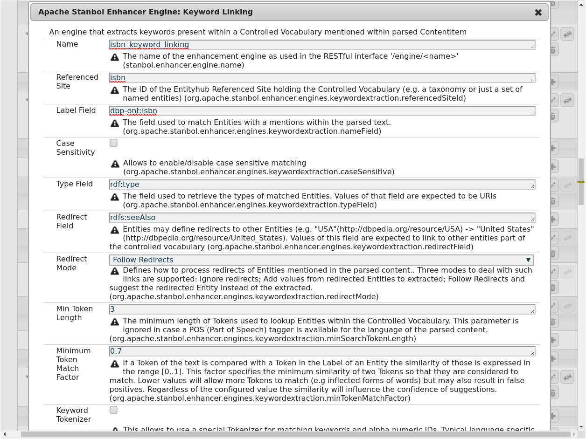
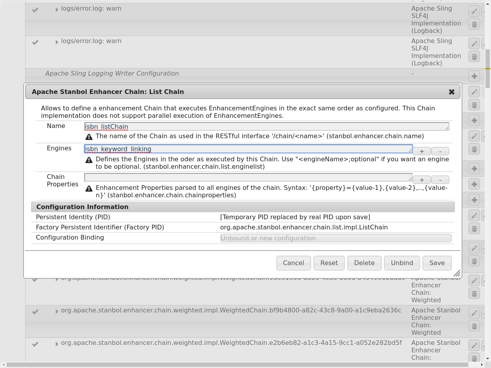
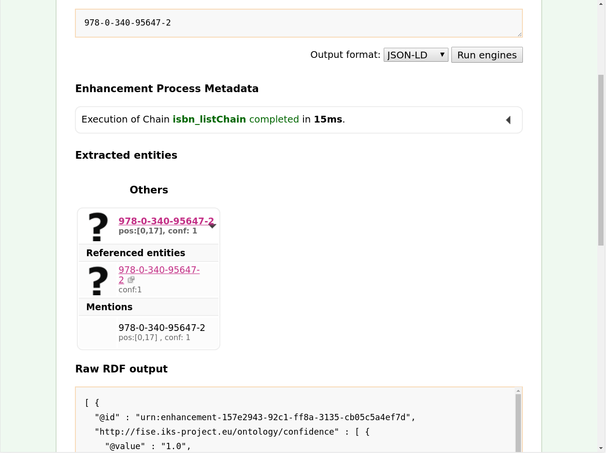

# 1 Example > 2 Exercise (Solved) 

Una vez que tenemos los datos cargados en un “site” queremos que estos sean reconocidos mediante el escaneador de contenidos [Enhancer](http://localhost:8080/enhancer). Para ello deberemos enlazar ese “site” con un procesador de contenidos, concretamente con “Keyword Linking Engine”. Para ello volveremos a acceder al panel oculto de configuración mediante el siguiente enlace [localhost:8080/system/console/configMgr](http://localhost:8080/system/console/configMgr) y, en la sección “OSGi”>”Configuration”, buscaremos la opción “Apache Stanbol Enhancer Engine: Keyword Linking” añadiendo otro mediante el botón a su derecha `+`.

Ahora rellenaremos los campos con las siguientes opciones (dejando igual el resto):

+ Name: isbn_keyword_linking
+ Referenced Site: isbn
+ Label Field: dbp-ont:isbn
+ Redirect Mode: Follow Redirect

Quedando la configuración así:

A continuación enlazaremos este motor con un “Chain”. Este “Chain” le indicará al [Enhancer](http://localhost:8080/enhancer) los pasos a seguir para procesar el contenido. Para crearlo volveremos a acceder al panel oculto de configuración mediante el siguiente enlace [localhost:8080/system/console/configMgr](http://localhost:8080/system/console/configMgr) y, en la sección “OSGi”>”Configuration”, buscaremos la opción “Apache Stanbol Enhancer Chain: List Chain” añadiendo otro mediante el botón a su derecha `+`.
Ahora rellenaremos los campos con las siguientes opciones (dejando igual el resto):

+ Name: isbn_listChain
+ Engines: isbn_keyword_linking

Quedando la configuración así:

Tras esto podremos acceder a la sección [Enhancer](http://localhost:8080/enhancer) de nuestra instancia de Apache Stanbol y seleccionar entre los posibles “[Enhancement Chains](http://localhost:8080/enhancer/chain)” el que acabamos de crear (o mediante el siguiente [enlace](http://localhost:8080/enhancer/chain/isbn_listChain)). Ahí podremos introducir un ISBN de los contenidos en nuestro “site” y será encontrado como muestra el siguiente ejemplo:

