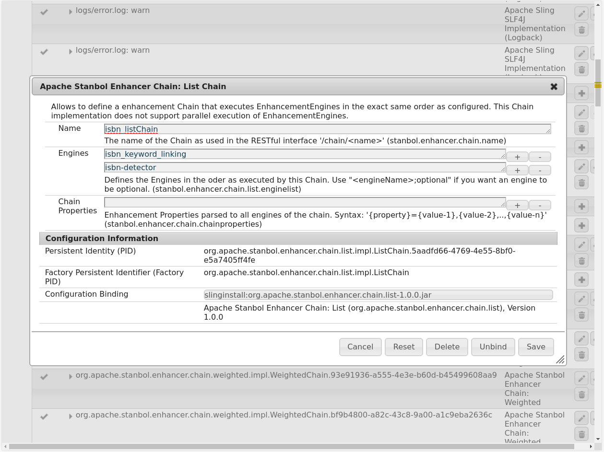
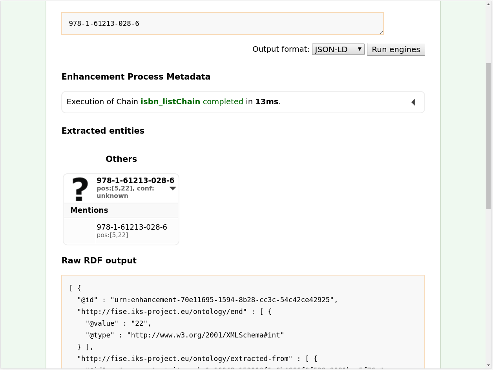

# 1 Example > 3 Exercise (Solved) 

En este apartado vamos a crear un motor de reconocimiento (“Enhancement Engine”) personalizado con el cual detectaremos los ISBN debido a que tienen una forma única. Para ello usamos un proyecto base adaptado y actualizado a nuestras necesidades que se puede descargar [aquí](https://github.com/ManuelLR/apache-stanbol-example/tree/master/1_Example/3_Exercise). Una vez descargado, accederemos a él y ejecutaremos el siguiente comando:

```
mvn install
```
En caso de que deseemos usarlo desde eclipse mediante la función de importación de proyecto de maven deberemos ejecutar además este comando antes de importarlo a eclipse:

```
mvn eclipse:eclipse
```
En este proyecto definiremos el pattern a buscar, qué hacer cuando lo encuentra y como procesarlo posteriormente. Podemos encontrar el proyecto debidamente completado [aquí](https://github.com/ManuelLR/apache-stanbol-example/tree/master/1_Example/3_Exercise_Solved).

Una vez que hemos rellenado todo lo necesario será el momento de importarlo a nuestra instancia de Apache Stanbol. Para ello ejecutaremos el siguiente comando:

```
mvn install -DskipTests -PinstallBundle \
    -Dsling.url=http://localhost:8080/system/console
```

Con esto ya podríamos encontrarlo entre las configuraciones del panel oculto de configuración mediante el siguiente enlace [localhost:8080/system/console/configMgr](http://localhost:8080/system/console/configMgr) y buscando por el nombre definido en el archivo “metatype.properties” en la sección resources del proyecto que acabamos de instalar en la instancia de Apache Stanbol. Al darle a editar podremos ver el nombre que le ha puesto al motor. Lo guardaremos, en nuestro caso fue “isbn-detector”.

Finalmente, para comprobar que efectivamente funciona como se espera, lo enlazaremos al “Chain” definido previamente. Para eso accederemos nuevamente al panel oculto de configuración mediante el siguiente enlace [localhost:8080/system/console/configMgr](http://localhost:8080/system/console/configMgr) y, en la sección “OSGi”>”Configuration”, buscaremos la opción “Apache Stanbol Enhancer Chain: List Chain”. Justo debajo podremos observar el “List Chain” creado en el Apartado 2. Enlazar los ISBN con el “Keyword Linking Engine” por lo que procedemos a editarlo pulsando sobre el lápiz y, en la opción engines, añadimos otro pulsando sobre el símbolo “+” con el nombre anteriormente apuntado (“isbn-detector” en nuestro caso). Quedaría de la siguiente forma:



Ahora podremos acceder a la sección [Enhancer](http://localhost:8080/enhancer) de nuestra instancia de Apache Stanbol y seleccionar entre los posibles “[Enhancement Chains](http://localhost:8080/enhancer/chain)” el que acabamos de modificar (o mediante el siguiente [enlace](http://localhost:8080/enhancer/chain/isbn_listChain)). Ahí podremos introduciremos un ISBN no contenido en nuestro “site” y será detectado como muestra el siguiente ejemplo:



